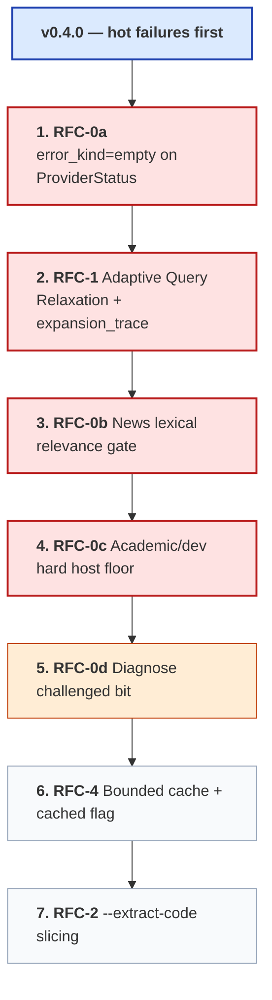

# Josty Project Roadmap

**Josty** is a zero-config, keyless metasearch engine and bounded content extraction tool designed specifically for AI agent runtimes and developer workflows.

This document is the release plan for `v0.4.0`. Features are ordered by **hot / high-ROI first**: live agent failure impact × fix size × how often the failure fires. Do not ship token-saving or cache-hygiene work ahead of empty-result and junk-result fixes.

---

## Core Invariants

Every feature added to Josty must adhere to these invariants:
1. **Zero-Daemon / In-Process Execution**: No background servers, Docker containers, or external databases. Runs as an instant CLI (`uvx josty`) or async Python library.
2. **Keyless Operation**: No mandatory API keys, registrations, or paid SaaS dependencies.
3. **Deterministic Output Contract**: `stdout` emits only pure, parseable JSON conforming to `schema_version: "1.0"`. Diagnostics route strictly to `stderr`.
4. **Minimal Footprint**: Zero heavy browser runtimes and minimal direct dependencies (`ddgs`, `httpx`, `trafilatura`).

---

## Priority stack (hot / high-ROI first)

Evidence: frozen scenario eval (7/10), benchmark empty-run rate (51%), live probes 2026-08-29. Taxonomy classes from [`docs/ISSUE_TAXONOMY.md`](docs/ISSUE_TAXONOMY.md).

| Rank | ID | Hot? | ROI | Why this order | Size |
|---|---|---|---|---|---|
| **1** | **RFC-0a** Surface `error_kind=empty` | 🔥 | ★★★★★ | Tiny 1.0-compatible change; stops agents treating empty-ok branches as “unknown health” | XS |
| **2** | **RFC-1** Adaptive Query Relaxation | 🔥 | ★★★★★ | Live: overconstrained → `status=complete` + `count=0`. Stub already in `research_run` (strip quotes / drop last token) and still fails — finish the 3-stage pipeline + `expansion_trace` | M |
| **3** | **RFC-0b** News lexical relevance gate | 🔥 | ★★★★☆ | 2 of 3 scenario failures (`news_token_collision`, `news_near_miss`); stops false citations without new backends | S |
| **4** | **RFC-0c** Academic/dev hard host floor | 🔥 | ★★★★☆ | Scenario + live: Wikipedia/AWS beat arXiv under `--profile academic`; 1.3–1.4× RRF weight is too weak | S–M |
| **5** | **RFC-0d** Diagnose `challenged` bit | warm | ★★★☆☆ | Brave HTTP 429 still `ok=true`; skill can already read `http_status`, so lower urgency than 1–4 | XS |
| **6** | **RFC-4** Bounded SQLite cache + `cached` | cool | ★★★☆☆ | Ops hygiene; cache exists but is unbounded. Prevents disk growth in agent loops — not a live miss | S |
| **7** | **RFC-2** `--extract-code` | cool | ★★☆☆☆ | Token savings on `--fetch`; does **not** fix empty/junk/throttle failures. Demoted from earlier `priority:high` | M |

**Ship order for `v0.4.0`:** `0a → 1 → 0b → 0c` as the hot tranche; then `0d → 4 → 2`.

---

## Milestone: v0.4.0 — Fix empty & junk, then bound & slice

### Hot tranche (do first)

#### RFC-0a — Surface `error_kind=empty` on empty-ok providers

- **Labels**: `enhancement`, `priority:critical`, `schema`
- **Component**: `engine.py` `_ddgs`
- **Problem**: Empty backends return `ok=true`, `result_count=0` with `error_kind` dropped. Agents cannot tell empty branch from healthy branch without reading counts carefully; taxonomy labels this `intended_misleading`.
- **Solution**: When ddgs raises the empty-results message, keep `ok=true` (contract preserved) but set `error_kind="empty"`.
- **Acceptance**:
  - [ ] Empty successful branches emit `error_kind: "empty"`.
  - [ ] Non-empty successes still have `error_kind: null`.
  - [ ] Scenario / unit coverage; no schema_version bump.

#### Feature 1 (RFC-1) — Adaptive Query Relaxation Pipeline (AQRP)

- **Labels**: `enhancement`, `rfc`, `priority:critical`
- **Component**: `engine.py`
- **Problem**: Reasoning models emit over-constrained queries (years, quotes, version tokens). Engines return 0 hits → `status=complete` + `count=0`. A one-shot stub already exists in `research_run` and is insufficient.
- **Solution**: Replace the stub with `relax_query(query, step)` stages:
  1. Strip trailing year / version anchors (`2026`, `latest`, `v3.1`).
  2. Strip quotes, boolean ops, punctuation noise.
  3. Drop lowest-IDF / modifier tokens.
  Stop at first non-empty fused result. Emit `expansion_trace: list[str]` on `SearchRun`; leave `query` untouched.
- **Acceptance**:
  - [ ] Triggers only on 0 fused results when providers are not all hard-failed.
  - [ ] `expansion_trace` in JSON; original `query` unchanged.
  - [ ] Unit tests per stage; live overconstrained probe returns ≥1 result or traces all stages.

#### RFC-0b — News lexical relevance gate

- **Labels**: `enhancement`, `priority:high`, `news`
- **Component**: `engine.py` (post-ddgs / pre-RRF or post-RRF filter for `category=news`)
- **Problem**: `ddgs.news("Python 3.14")` returns District 14 / iPhone 14. Upstream quality; josty can gate.
- **Solution**: Require subject query tokens (minus stopwords) to appear in title or snippet before a news hit is kept / ranked. Near-miss version tokens (found `3.15`, missing `3.14`) demote or drop.
- **Acceptance**:
  - [ ] Scenario cases `news_token_collision` and `news_near_miss` pass on frozen corpus after re-capture or synthetic rows.
  - [ ] Text category ranking unchanged.

#### RFC-0c — Academic / dev hard host floor

- **Labels**: `enhancement`, `priority:high`, `rank`
- **Component**: `rrf` / post-fusion rerank
- **Problem**: Soft 1.3–1.4× domain weights cannot beat 3-group RRF consensus. Academic RAG queries surface Wikipedia / AWS ahead of arXiv.
- **Solution**: When `profile` is `academic` or `dev` and ≥1 result is on a profile authority host, force those hosts into a top-k floor (or additive boost large enough to outrank single-list consensus).
- **Acceptance**:
  - [ ] `academic_profile_rag` scenario passes (required host in top results).
  - [ ] `dev_profile_fastapi` remains passing.

### Warm / cool tranche (after hot)

#### RFC-0d — Diagnose `challenged` bit

- **Labels**: `enhancement`, `priority:medium`, `diagnose`
- **Problem**: HTTP 403/429 probes report `ok=true` with no challenge signal.
- **Solution**: Add optional `challenged: bool` (or document-only skill rule). Prefer a bool on `HostStatus` if agents still misread `http_status`.
- **Acceptance**:
  - [ ] 429/403 set `challenged=true` while keeping reachability `ok=true`, **or** SKILL.md unambiguously requires reading `http_status`.

#### Feature 2 (RFC-4) — Bounded SQLite cache + `cached` flag

- **Labels**: `enhancement`, `rfc`, `priority:medium`
- **Problem**: Cache has TTL but no row ceiling / access telemetry / envelope `cached` flag.
- **Solution**: `hit_count` + `last_accessed`; prune when rows > 5,000; emit `cached: bool` on `SearchRun`.
- **Acceptance**:
  - [ ] `cached` in JSON; hit tracking; auto-eviction ≤ 5,000 rows; regression tests.

#### Feature 3 (RFC-2) — Token-budgeted code slicing (`--extract-code`)

- **Labels**: `enhancement`, `rfc`, `priority:low` *(demoted: not a failure fix)*
- **Problem**: `--fetch` injects large narrative markdown when agents only need fenced code.
- **Solution**: `--extract-code` + zero-dep fenced-block parser → `code_blocks` on `SearchResult`.
- **Acceptance**:
  - [ ] Flag wired; `code_blocks` populated; no new deps; edge-case tests.

---

## Explicitly deferred (not v0.4.0)

- Returning thin partials instead of empty under throttle (reliability trade-off; needs benchmark re-run).
- Default `--max-query-variants` for `oss`/multi-site (ops; document until measured).
- MCP / browser / paid search APIs — still non-goals.

---

## Out of Scope / Non-Goals

- ❌ **In-Process MCP Server Mode**
- ❌ **Heavy Browser Automation**
- ❌ **Paid API Key Integrations**

---

## Release Checklist (When Merging to Main)

1. **Changelog**: Add entries under `## [0.4.0]` in `CHANGELOG.md`.
2. **Skill Definition**: Sync `.agents/skills/josty/SKILL.md` (relaxation, news gate, `error_kind=empty`, new flags).
3. **Version Bump**: `0.3.0` → `0.4.0` in `pyproject.toml`.
4. **Git Tag & Release**: `git tag v0.4.0` + GitHub Release.
5. **Scenario eval**: Hot tranche must not regress `tests/scenario_eval.py` (target ≥ 9/10 before tagging).
6. **Auto-Close Issues**: Link PR commits to tracking issues.
