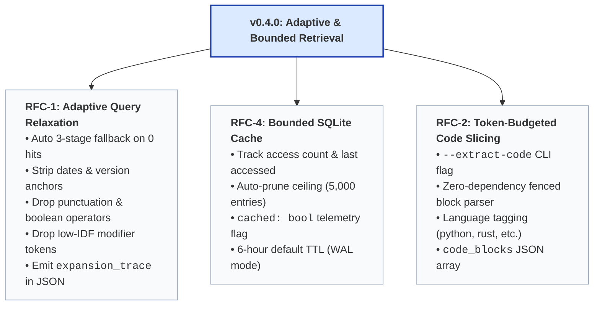

# Josty Project Roadmap

**Josty** is a zero-config, keyless metasearch engine and bounded content extraction tool designed specifically for AI agent runtimes and developer workflows.

This document serves as the roadmap, technical specification reference, and tracking guide for release milestones and future GitHub issues.

---

## Core Invariants

Every feature added to Josty must adhere to these invariants:
1. **Zero-Daemon / In-Process Execution**: No background servers, Docker containers, or external databases. Runs as an instant CLI (`uvx josty`) or async Python library.
2. **Keyless Operation**: No mandatory API keys, registrations, or paid SaaS dependencies.
3. **Deterministic Output Contract**: `stdout` emits only pure, parseable JSON conforming to `schema_version: "1.0"`. Diagnostics route strictly to `stderr`.
4. **Minimal Footprint**: Zero heavy browser runtimes and minimal direct dependencies (`ddgs`, `httpx`, `trafilatura`).

---

## Milestone: v0.4.0 — Adaptive & Bounded Retrieval

The goal of `v0.4.0` is to eliminate empty-result retrieval failures on complex queries, provide token-budgeted code extraction, and bound disk cache growth.



---

## Feature Specifications & Issue Guide

### Feature 1 (RFC-1): Adaptive Query Relaxation Pipeline (AQRP)

- **Suggested Issue Title**: `[RFC-1] Adaptive Query Relaxation Pipeline (AQRP) on 0-result searches`
- **Labels**: `enhancement`, `rfc`, `priority:high`
- **Component**: `.agents/skills/josty/src/josty/engine.py`

#### Problem
Reasoning models frequently construct over-constrained queries with trailing years (e.g. `2026`), strict quotes, or 8+ keyword terms. Because underlying search engines treat multi-word queries as strict boolean conjunctions, this frequently causes empty results.

#### Solution
1. Implement pure-Python relaxation helper `relax_query(query: str, step: int) -> str | None`:
   - **Stage 1 (Temporal/Version Stripping):** Strip trailing year and release version tokens (e.g. `2025`, `2026`, `latest`, `v2`, `v3.1`).
   - **Stage 2 (Quote/Syntax Normalization):** Strip exact-match quotes, boolean operators (`AND`, `OR`), and punctuation noise.
   - **Stage 3 (Progressive Keyword Dropping):** Drop lowest IDF/modifier tokens to isolate core noun phrases.
2. In `Josty.research_run()`:
   - If initial parallel fanout returns 0 results and error is not a network failure, iteratively execute relaxation stages 1 to 3.
   - Stop at the first stage that returns non-empty fused results.
   - Populate `expansion_trace: list[str]` in `SearchRun` (e.g. `["original query", "stage 1 query"]`).

#### Acceptance Criteria
- [ ] Automatically triggers on 0 results from initial search pass.
- [ ] `expansion_trace: list[str]` emitted in `SearchRun` dataclass and JSON contract.
- [ ] Original `query` field remains untouched to preserve caller contract.
- [ ] Unit tests in `tests/test_engine.py` verifying each relaxation stage.

---

### Feature 2 (RFC-4): Enhanced Bounded SQLite Cache with Access Telemetry

- **Suggested Issue Title**: `[RFC-4] Enhanced Bounded SQLite Cache with Access Telemetry & cached Flag`
- **Labels**: `enhancement`, `rfc`, `priority:medium`
- **Component**: `.agents/skills/josty/src/josty/engine.py`

#### Problem
Repeated queries across agent execution loops should be served locally without hitting network rate limits, while preventing unbounded disk database growth.

#### Solution
1. **Schema Migration:**
   ```sql
   ALTER TABLE search_cache ADD COLUMN hit_count INTEGER DEFAULT 0;
   ALTER TABLE search_cache ADD COLUMN last_accessed REAL DEFAULT 0;
   ```
2. **Access Tracking:** On cache hit, increment `hit_count` and update `last_accessed = time.time()`.
3. **Bounded Auto-Pruning:** When total cache rows exceed 5,000, prune expired and least frequently accessed records:
   ```sql
   DELETE FROM search_cache WHERE key IN (
       SELECT key FROM search_cache ORDER BY expires_at ASC, hit_count ASC LIMIT 500
   );
   ```
4. **Envelope Telemetry:** Add `cached: bool = False` to `SearchRun` dataclass and JSON output envelope.

#### Acceptance Criteria
- [ ] `cached: bool` flag added to `SearchRun` JSON output schema.
- [ ] Cache hits update `hit_count` and `last_accessed`.
- [ ] Auto-eviction prevents cache table from exceeding 5,000 entries.
- [ ] Full regression test coverage in `tests/test_engine.py`.

---

### Feature 3 (RFC-2): Token-Budgeted Code Slicing (TBCS)

- **Suggested Issue Title**: `[RFC-2] Token-Budgeted Code Slicing (--extract-code) for Bounded Markdown`
- **Labels**: `enhancement`, `rfc`, `priority:high`
- **Component**: `.agents/skills/josty/src/josty/engine.py`, `.agents/skills/josty/src/josty/cli.py`

#### Problem
When agents query technical documentation or code examples, fetching full markdown pages injects 10KB–50KB of surrounding narrative text when only a 10-line code snippet is needed.

#### Solution
1. **CLI & API Ergonomics:**
   - Add CLI flag `--extract-code` in `josty.cli`.
   - Add `extract_code: bool = False` parameter in `Josty.research_run()`.
2. **Zero-Dependency Markdown Parser:**
   - State-machine / regex parser extracting fenced code blocks: ````(\w+)?\n([\s\S]*?)````.
   - Extracts programming language tag (`python`, `rust`, `bash`, `typescript`, etc.) and code body.
3. **Data Model:**
   ```python
   @dataclass
   class CodeBlock:
       language: str
       code: str
   ```
   Add `code_blocks: list[dict[str, str]] | None = None` to `SearchResult`.

#### Acceptance Criteria
- [ ] `--extract-code` flag added to `josty.cli` (activates code extraction on `--fetch`).
- [ ] `code_blocks` populated in `SearchResult` JSON output when enabled.
- [ ] Zero new runtime dependencies added to `pyproject.toml`.
- [ ] Tests covering single-language, multi-language, and empty-code edge cases.

---

## Out of Scope / Non-Goals

- ❌ **In-Process MCP Server Mode**: Keeping Josty focused strictly as a clean CLI and Python library primitive.
- ❌ **Heavy Browser Automation**: No Puppeteer/Playwright/Selenium runtimes.
- ❌ **Paid API Key Integrations**: No mandatory paid third-party search APIs.

---

## Release Checklist (When Merging to Main)

1. **Changelog**: Add entries under `## [0.4.0]` in `CHANGELOG.md` following [Keep a Changelog](https://keepachangelog.com/).
2. **Skill Definition**: Synchronize `.agents/skills/josty/SKILL.md` with new flags (`--extract-code`).
3. **Version Bump**: Increment version in `pyproject.toml` (`0.3.0` $\to$ `0.4.0`).
4. **Git Tag & Release**: Tag release (`git tag v0.4.0`) and create GitHub Release (`gh release create v0.4.0`).
5. **Auto-Close Issues**: Link PR commits to close corresponding tracking issues (`Closes #1`).
