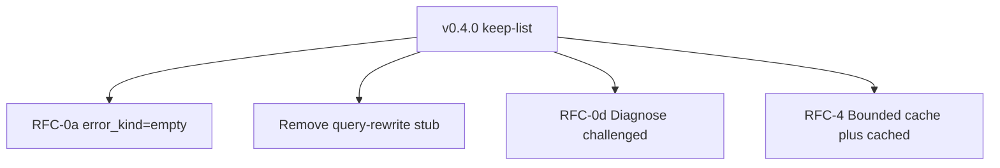

# Josty Project Roadmap

**Josty** is a zero-config, keyless metasearch engine and bounded content extraction tool designed specifically for AI agent runtimes and developer workflows.

This document is the release plan for `v0.4.0`. Features are ordered by **signal first**: surface what ddgs actually returned, bound local state, and drop hidden retries that make the wrapper noisier than raw ddgs.

---

## Core Invariants

Every feature added to Josty must adhere to these invariants:
1. **Zero-Daemon / In-Process Execution**: No background servers, Docker containers, or external databases. Runs as an instant CLI (`uvx josty`) or async Python library.
2. **Keyless Operation**: No mandatory API keys, registrations, or paid SaaS dependencies.
3. **Deterministic Output Contract**: `stdout` emits only pure, parseable JSON conforming to `schema_version: "1.0"`. Diagnostics route strictly to `stderr`.
4. **Minimal Footprint**: Zero heavy browser runtimes and minimal direct dependencies (`ddgs`, `httpx`, `trafilatura`).
5. **No hidden amplification**: Do not rewrite queries or retry backends automatically. Empty or junk upstream rows are passed through with `error_kind` / `challenged` set when those cases apply.

---

## Priority stack

| Rank | ID | In v0.4.0? | Why |
|---|---|---|---|
| 1 | **RFC-0a** Surface `error_kind=empty` | yes | Tiny 1.0-compatible signal; empty-ok is not “unknown health” |
| 2 | **Remove query-rewrite stub** | yes | The one-shot relaxation in `research_run` doubled empty-query traffic |
| 3 | **RFC-0d** Diagnose `challenged` | yes | 401/403/429 stay `ok=true` (reachable) and set `challenged=true` |
| 4 | **RFC-4** Bounded SQLite cache + `cached` | yes | TTL already existed; add row cap, hit tracking, envelope flag |
| — | **RFC-1** Adaptive Query Relaxation | **no** | Extra ddgs calls under throttle; agents should rewrite queries |
| — | **RFC-0b** News lexical engine filter | **no** | Ranking policy. Skill already: require subject tokens before citing |
| — | **RFC-0c** Academic/dev hard host floor | **no** | Would override engine ranking |
| — | **RFC-2** `--extract-code` | later | Token savings, not a failure-mode fix |

---

## Milestone: v0.4.0 — Empty signals, no rewrite, bounded cache

### RFC-0a — Surface `error_kind=empty` on empty-ok providers

- **Labels**: `enhancement`, `priority:high`, `schema`
- **Component**: `engine.py` `_ddgs`
- **Problem**: Empty backends returned `ok=true`, `result_count=0` with `error_kind` dropped. Agents could not tell empty from “unclassified.”
- **Solution**: Keep `ok=true`. Set `error_kind="empty"` when a successful branch has zero rows (empty list **and** ddgs “no results found”).
- **Acceptance**:
  - [x] Empty successful branches emit `error_kind: "empty"`.
  - [x] Non-empty successes still have `error_kind: null`.
  - [x] No schema_version bump.

### Remove query-rewrite stub

- **Problem**: `research_run` retried a stripped/shortened query on 0 fused hits, contradicting SKILL.md (“no automatic retry”) and amplifying empty runs.
- **Solution**: Delete the fallback. Callers rewrite; josty searches once.
- **Acceptance**:
  - [x] One `_search_parts` fanout per `research_run`.
  - [x] Tests assert no second call on 3+ word empty queries.

### RFC-0d — Diagnose `challenged` bit

- **Labels**: `enhancement`, `priority:medium`, `diagnose`
- **Problem**: HTTP 403/429 probes reported `ok=true` with no challenge signal beyond `http_status`.
- **Solution**: `HostStatus.challenged` is true when `ok` and `http_status` in `{401, 403, 429}`. Reachability unchanged.
- **Acceptance**:
  - [x] 429/403 set `challenged=true` while `ok=true`.
  - [x] 200 stays `challenged=false`.

### RFC-4 — Bounded SQLite cache + `cached` flag

- **Labels**: `enhancement`, `rfc`, `priority:medium`
- **Problem**: Cache had TTL but no row ceiling, access telemetry, or envelope `cached` flag.
- **Solution**: `hit_count` + `last_accessed`; prune 500 rows when count exceeds 5,000 (`expires_at ASC, hit_count ASC`); emit `cached: bool` on `SearchRun` (true only on cache hit).
- **Acceptance**:
  - [x] `cached` in JSON; hit tracking; auto-eviction; regression tests.

---

## Explicitly deferred

- RFC-1 query relaxation / `expansion_trace`.
- Engine-side news lexical gate (skill rule remains).
- Academic/dev hard host floor.
- RFC-2 `--extract-code`.
- Returning thin partials instead of empty under throttle (needs a measured benchmark, not a silent merge).
- MCP / browser / paid search APIs — non-goals.

---

## Out of Scope / Non-Goals

- In-process MCP server mode
- Heavy browser automation
- Paid API key integrations
- Hidden query rewrite or extra backend retries

---

## Release Checklist (When Merging to Main)

1. **Changelog**: Convert `## [Unreleased]` in `CHANGELOG.md` to `## [X.Y.Z] - YYYY-MM-DD`.
2. **Skill Definition**: Sync `.agents/skills/josty/SKILL.md` with any contract changes.
3. **Version Bump**: bump the single `__version__` literal in `.agents/skills/josty/src/josty/engine.py`
   (drives `pyproject.toml` via hatchling `dynamic = ["version"]`) at release time.
4. **PyPI Publish**: build sdist/wheel (`python -m build`) from the release commit and upload
   (e.g. `twine upload dist/*` or `uv publish`). PyPI is the single engine source — every
   distribution path (uvx, pip, the belt skill) serves the installed CLI, so a missed publish
   makes `uvx josty` silently stale.
5. **Belt Skill Upload**: `belt skill upload .agents/skills/josty/SKILL.md --name josty`.
   Same name = a new belt version; identical content is deduped. The belt skill is
   instructions-only and drifts from the contract until re-uploaded.
6. **Git Tag & Release**: `git tag vX.Y.Z` + GitHub Release when cutting the version.
7. **Scenario eval**: News/academic cases remain documented `upstream_quality` / `product_gap` unless labeled otherwise.
8. **Auto-Close Issues**: Link PR commits to tracking issues.
